<div align="center">



<br />

<a href="https://www.nimnabro.com/"></a>

### Game Systems Developer · UEFN Creator · Web & Automation Builder


[](https://www.nimnabro.com/)
[](https://www.fortnite.com/@nimnabro?lang=en-US)
[](mailto:nimnabrocontact@gmail.com)


</div>

## `> whoami`

I design and build **interactive systems**—from gameplay mechanics and UEFN experiences to web platforms, server utilities, and creator automation. I care about the complete build: the idea, the structure behind it, and the experience people actually use.

```text
ROLE      Game Systems Developer · UEFN Creator · Web & Automation Builder
BASED     Sri Lanka 🇱🇰
FOCUS     Games · Systems · Tools · Servers · Interfaces
MINDSET   Learn what the build needs, then make it work
```

## `> ./build-loop`

<div align="center">


</div>

## `> cat focus.json`

| Area | What I build |
| :--- | :--- |
| 🎮 **Game Design** | Gameplay mechanics, progression loops, and replayable experiences |
| 🧩 **System Architecture** | Connected systems that stay clear, reliable, and maintainable |
| 🌐 **Server Development** | Multiplayer utilities and community-facing services |
| 🖥️ **Game & Tool UI** | Interfaces that make complex features easy to use |
| ⚡ **Automation** | Practical tools that remove repetitive work |

## `> ls toolkit/`

<div align="center">


<br />

<br /><br />


</div>

## `> ls featured-builds/`

<details open>
<summary><b>▶ Goldstone County Launcher — community game utility</b></summary>

<br />

An all-in-one Windows launcher built to get Goldstone County RP players into the game faster and help them recover from common RedM issues.

| | |
| :--- | :--- |
| **Built for** | Goldstone County RP, Sri Lanka |
| **Features** | One-click joining, TeamSpeak setup, RedM repair tools, cache cleanup, and automatic updates |
| **My contribution** | Designed and developed the player-facing launcher and its supporting workflow |
| **Explore** | [Repository](https://github.com/nimnabrox/goldstonelauncher) · [Latest release](https://github.com/nimnabrox/goldstonelauncher/releases/latest) · [User guide](https://guidegoldstonerplauncher.netlify.app/) |

</details>

<details>
<summary><b>▶ NimnaBro UEFN Islands — playable Fortnite experiences</b></summary>

<br />

Published Fortnite experiences built around competitive play, progression, and community-driven gameplay.

| | |
| :--- | :--- |
| **Platform** | Unreal Editor for Fortnite (UEFN) |
| **Focus** | Game systems, mechanics, UI, balance, and replayability |
| **Explore** | [Play my islands on Fortnite](https://www.fortnite.com/@nimnabro?lang=en-US) |

</details>

<details>
<summary><b>▶ NimnaBro.com — my creator and project hub</b></summary>

<br />

My central home for games, development work, creator content, and everything I am building next.

| | |
| :--- | :--- |
| **Focus** | Personal brand, projects, games, and community |
| **Explore** | [Visit nimnabro.com](https://www.nimnabro.com/) |

</details>

## `> cat creator-highlights.log`

- 🏆 **Top 10 worldwide** on the Fortnite Showdown Creator Leaderboard
- 🇱🇰 **#1 in Sri Lanka** on the Fortnite Showdown Creator Leaderboard
- 🤝 **Epic Games Support-A-Creator Partner** — creator code `nimnabro`
- 🗺️ Published UEFN creator with multiple playable Fortnite islands

## `> ./github-analytics`

<div align="center">


</div>

## `> ./contribution-snake --neon`

<div align="center">

<picture>
  <source media="(prefers-color-scheme: dark)" srcset="https://raw.githubusercontent.com/nimnabrox/nimnabrox/output/github-snake-dark.svg" />
  <source media="(prefers-color-scheme: light)" srcset="https://raw.githubusercontent.com/nimnabrox/nimnabrox/output/github-snake.svg" />
  
</picture>

</div>

## `> cat current-focus.yaml`

```yaml
building:
  - gameplay systems and UEFN experiences
  - tools for creators, players, and online communities
  - web utilities and workflow automation

improving:
  - multiplayer and server architecture
  - responsive interfaces for games and tools
  - the path from rough idea to reliable product

open_to:
  - creative collaborations
  - game and tool development projects
  - interesting problems that need a working solution
```

## `> ./connect --with-me`

<div align="center">

[](https://www.nimnabro.com/)
[](https://www.youtube.com/@nimna_bro_)
[](https://www.tiktok.com/@nimnabro)
[](https://www.twitch.tv/nimnabro)
[](https://kick.com/nimnabro)
[](https://x.com/nimna_bro_)

<br />

### Building interactive worlds, useful tools, and systems that work.


</div>
